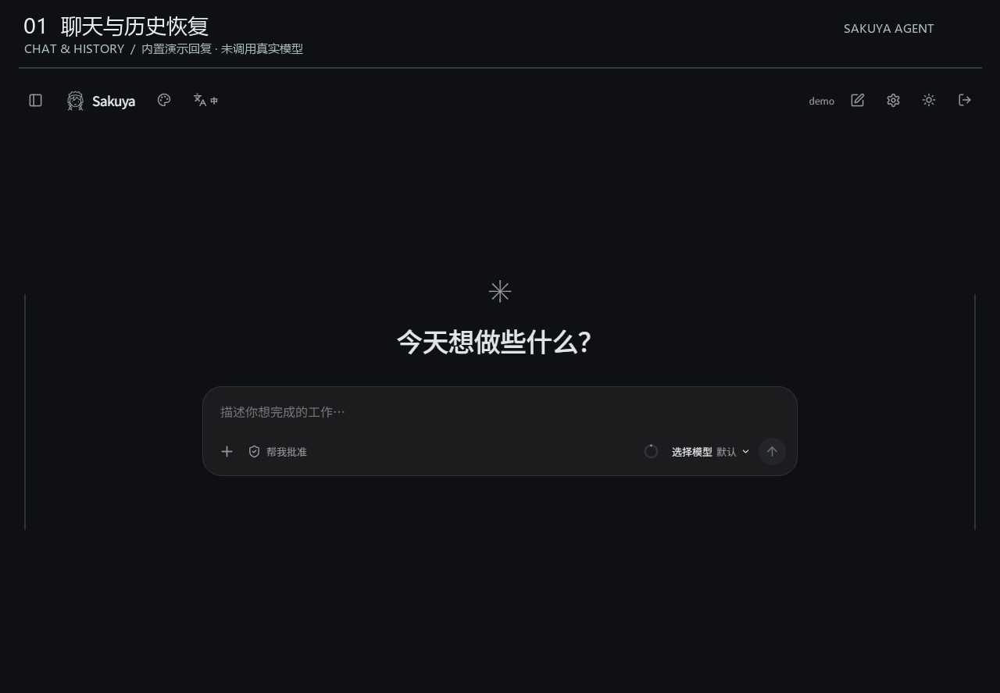
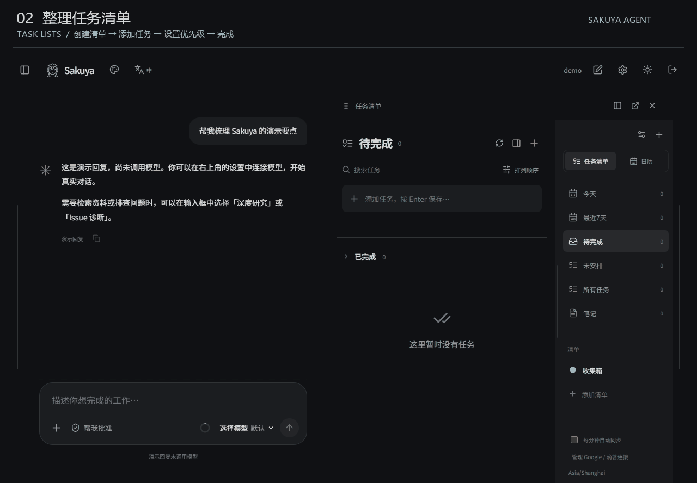
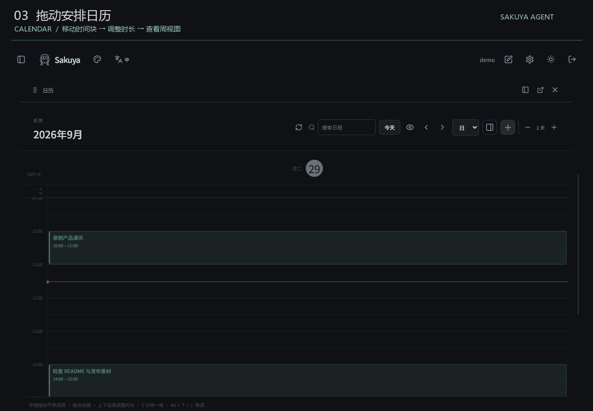

# Sakuya Agent

[English](README.md) | **简体中文**

Sakuya Agent 是一个**本地 AI 任务与日程管理工作助手**。在同一工作区整理任务清单、安排日历，并通过聊天让 AI 读取当前安排、创建或修改任务和日程。React + TypeScript 提供网页与 Electron 桌面界面，Python + LangGraph 支持有状态的助手工作流。

任务清单支持优先级、完成状态和批量操作；日历支持日／周／月视图、1–14 天显示、拖动安排与调整时长。清单可连接 Google 日历及国内滴答或国际 TickTick；同步冲突会在界面中提示。详见 [规划功能说明](docs/PLANNER.md)。仓库仅包含源码，不包含用户数据；Windows 安装包见 [Release](https://github.com/ggghhh16/Sakuya-Agent/releases)。

个人使用请选择 **Client**：无需 Sakuya 账号或登录，移除了工单和 Issue 诊断。**Dev** 保留原完整功能及认证流程。两版的安装标识、数据目录和端口独立，可同时运行；真实 AI 功能仍需配置自己的模型 API。详见[版本说明](docs/EDITIONS.md)，下文认证配置适用于 Dev。

Windows v0.2.1 下载：[Client](https://github.com/ggghhh16/Sakuya-Agent/releases/tag/v0.2.1-client) · [Dev](https://github.com/ggghhh16/Sakuya-Agent/releases/tag/v0.2.1)。两个版本均附 SHA-256 校验文件；本次验证与限制见[安全及本地残留审计](docs/SECURITY-AUDIT-2026-09-29.md)。

默认采用极简深色界面：聊天首页保留输入框和助手选择，工作视图可在聊天旁展开任务清单和日历。菜单、侧边抽屉和弹窗支持打开与收回动画，并遵循系统的减少动态效果设置。右上角提供语言、主题切换与主题设置。

聊天回复支持流式显示；任务支持从空白处拖动框选和批量操作。任务、时间块可拖入聊天，发送时将完整引用信息交给当前选中的模型。启用任务与日历工具后，支持工具调用的模型还可读取和修改本机规划。

## 功能演示

以下 3 张 GIF 录自真实应用界面，使用独立的本地演示工作区。聊天采用内置**演示模式**，回复不代表真实模型输出；任务和日历修改由本地后端实际保存。

### 1. 聊天与历史恢复

发送消息、新建对话，再从历史记录打开原对话；刷新后仍保留聊天内容。



### 2. 整理任务清单

创建带颜色的清单，快速添加三个任务，设置高优先级，并完成其中一项。



### 3. 拖动安排日历

拖动时间块修改开始时间，拉伸至 90 分钟，查看详情，再切换周视图。



[录制说明与复现方法](docs/demos/README.md)

## 界面语言

v0.2.1 新增「今日地图」：语言按钮右侧的小地图图标可展开地图，显示今天任务和日程关联的建筑地点。自动识别地点字段、标题或备注中的明确地点并标记匹配建筑，无需选择建筑；任务中的教室号保留，发送搜索关键词时去掉教室号。支持同楼多项安排合并、本地保存及可选的地点校正；首次使用需要配置自己的高德凭据。使用方式与已验证范围见 [今日地图说明](docs/map-implementation.md)。

主界面右上角的语言按钮展开简体中文、English、日本語列表；登录和注册页也有入口。首次使用跟随浏览器语言，选择后在当前浏览器或桌面配置中保存，刷新后保留。切换不清空草稿，也不翻译用户输入、已有聊天、报告和原始执行日志。

## 账号与多模型

支持邮箱注册、Turnstile 人机验证、SMTP 邮箱验证码及密码强度校验。不同账号的聊天、任务、日历和模型配置相互隔离。登录可选择记住 30 天。设置支持多个 Chat Completions 兼容供应商、自动发现模型、聊天模型切换及思考强度滑条。

**首次使用必须配置验证服务并初始化管理员**，参见 [配置与权限说明](docs/ACCOUNTS-MODELS.md)。应用面向本机使用，尚未提供公网部署。

## 日常使用：无需提前运行命令

- 安装版：从上方 Release 下载对应版本安装器，安装后使用 **Sakuya Client** 或 **Sakuya Agent** 快捷方式。
- 本地显式分版构建：Dev 位于 `release-dev/win-unpacked/Sakuya Agent.exe`，Client 位于 `release-client/win-unpacked/Sakuya Client.exe`。旧版正在运行时，先退出旧程序；项目根目录已有快捷方式可能仍指向历史构建，不会由分版打包自动改写。
- 网页端：双击 **Sakuya Web.lnk**。应用会启动本地服务，随后打开默认浏览器，地址为 `http://127.0.0.1:8120`。
- 网页模式在系统托盘后台运行；可以从托盘打开桌面端或选择「退出 Sakuya（停止本地服务）」。关闭浏览器不会自动停止服务。
- 仅使用桌面端时，关闭窗口会停止由该应用启动的服务；如果已打开网页模式，关闭桌面窗口会保留后台服务。
- 再次启动会复用已有实例，不重复启动后端，也不会关闭其他进程提供的服务。

桌面包已包含 Python、后端依赖及网页资源，**日常使用不需要安装或手动运行 Node.js/Python**。复制到其他位置时保留对应版本的整个 `win-unpacked` 文件夹，不要只复制 EXE。应用尚未签名。

普通浏览器书签无法启动一个已经关闭的本地程序；服务退出后使用 **Sakuya Web.lnk** 重新打开网页版。没有添加开机自启或系统服务。

从本项目构建目录启动时继续使用原来的 `.data`，保留聊天、配置与排序；将完整程序目录复制出去后，数据保存于当前用户的应用数据目录。启动日志位于对应数据目录的 `service.log`。

## 开发与重新构建

仅开发和打包需要 Node.js **22.12+**、Python **3.11+**；Windows 下已用 Node 24、Python 3.14 验证。

```powershell
git clone https://github.com/ggghhh16/Sakuya-Agent.git
cd Sakuya-Agent
.\scripts\setup.ps1
node scripts/dev.mjs       # 开发服务器与热更新
node scripts/package.mjs   # 更新现有快捷方式使用的 release-v020/win-unpacked
```

默认打包继续更新 `release-v020`，加 `--installer` 可同时生成该目录的安装包。显式使用 `--edition=dev` 或 `--edition=client` 时，分别输出到 `release-dev` 或 `release-client`。

- 开发网页：`http://127.0.0.1:5173`；普通使用入口：`http://127.0.0.1:8120`。
- `start.ps1` 现在启动打包的桌面应用；`start.ps1 --web` 启动网页版。
- 没有全局 npm 时，安装脚本会在 `.tools` 中安装项目专用 npm。
- 独立后端使用 PyInstaller；打包依赖记录在 `backend/requirements-build.txt`。

从源码克隆后需要先安装依赖、配置验证服务并初始化管理员；仓库不包含桌面成品、密钥或用户数据。演示模式不需要模型 API Key；演示内容会明确标记，不代表真实模型输出。让助手实际管理任务和日程时，需要配置支持工具调用的模型并启用「任务与日历 MCP」。

## 真实模型与搜索

点击右上角设置，添加供应商名称、模型根地址和密钥，自动加载模型后添加到聊天模型列表。支持 Chat Completions 兼容接口；模型须支持 JSON 格式输出。也可以复制 `.env.example` 为 `.env`。

```dotenv
MODEL_BASE_URL=https://your-provider.example/v1
MODEL_NAME=your-model-id
MODEL_API_KEY=your-key
TAVILY_API_KEY=your-search-key
GITHUB_TOKEN=optional-read-only-token
```

界面配置优先于环境变量。界面保存的密钥位于本机 `.data/provider.json`，**明文保存，仅用于本地个人工作区**；API 不向浏览器回传密钥，整个 `.data` 和 `.env` 已加入 `.gitignore`。不要上传它们。

安全修复版会限制 `.data`、`.env` 与发布目录的 OS 访问权限；已有目录属于其他 Windows 账号时，需要先停止应用再执行 `scripts/protect-local-data.ps1`（PowerShell 7），脚本保留并校验恢复备份。审计结果、备份位置和验证边界见 [安全审计记录](docs/SECURITY-AUDIT.md)。

关闭任务创建表单中的「演示模式」才能调用真实服务。未配置 Tavily 时仍可读取项目文档及用户提供的允许域名链接，但不会自动执行外部搜索。默认域名名单见设置页，可通过 `RESEARCH_ALLOWED_HOSTS` 扩展。

网络适配器支持环境变量代理与 Windows 系统代理。经可信 HTTPS 代理请求时，由代理解析允许的公开域名；直连时额外检查 DNS 结果，拒绝本机和私网目标。每次重定向都重新检查协议、端口与域名。

## 已实现的流程

### 任务清单与日历

工作视图新增「任务清单」和「日历」：自定义清单、优先级、完成与撤销、日／周／月视图、5 分钟拖动和拉伸、全天／跨日事件、弹窗与抽屉进出动画。每个清单可分别绑定 Google 日历以及国内滴答／国际 TickTick 清单，两版在连接设置切换。

聊天可启用本机任务与日历 MCP，读取现有安排、创建和修改任务／日程并执行同步。需使用支持工具调用的真实模型，演示模式不执行工具。

首次使用需在规划视图「连接设置」完成账号授权。使用方式、同步策略及与 Notion Calendar 的功能差异见 [规划功能说明](docs/PLANNER.md)。

### 聊天助手

- 普通多轮对话，消息与回复持久化到 SQLite，支持历史记录和刷新恢复。
- 聊天记录右键可重命名、删除；按住左键拖动可保存自定义顺序。继续聊天或改名不会打乱排序，新对话置顶。也可使用每行的更多按钮，以及 Alt+↑/↓ 调整顺序。
- 删除采用本地软删除：从记录和搜索中移除，取消该对话待执行或执行中的回复，短暂提示中可撤销。撤销不会重新启动已取消的生成。
- Enter 发送、Shift+Enter 换行，中文输入法选词不会误发送；可停止等待中的生成。
- 可在聊天旁打开任务清单或日历，也可按需使用深度研究。
- 未配置模型时显示明确标记的固定演示回复；配置模型后默认使用真实模式。「+」中可切换演示模式。
- 普通聊天不调用搜索或代码执行工具；启用「任务与日历 MCP」后可调用规划工具，显示执行记录。当前以完整回复返回，不逐 token 流式输出。模型上下文最多包含最近 12 轮同模式的成功对话，每条历史消息上限 4000 字符；界面保留完整消息。

### Deep Research

1. 根据问题与项目约束制定研究计划和搜索词。
2. 检索项目 Markdown 片段、读取资料链接、调用 Tavily 搜索。
3. 检查信息缺口，最多进行两轮资料收集。
4. 可选：生成最小 Python 实验并暂停，等待用户审核。
5. 输出带引用编号的 Markdown 报告，保存资料原文片段和运行事件。
6. 导出报告（知识库入口暂时隐藏）。

项目文档检索使用中文双字词与英文标识符的分块关键词检索，保留原文偏移；**当前没有向量数据库或 embedding 检索**。引用编号检查只验证引用是否能映射到来源，不能替代“来源是否支持结论”的人工评测。

### 共享能力

- 旧 Markdown 资料保留；知识库入口暂时隐藏。
- 全局搜索（Ctrl/Cmd + K）、深浅主题、窄屏布局。
- SQLite 持久化任务队列、独立 Worker、SSE 进度与轮询恢复。
- LangGraph SQLite 检查点、人工审核后恢复、失败重试、任务取消。
- Worker 心跳过期后将任务重新排队，从最近检查点继续。

## 实验环境

真实代码仅在 Docker 中执行，不在宿主机运行。需要预先安装 Docker 并准备镜像：

```powershell
docker pull python:3.12-slim
```

容器限制：禁网、只读根目录、非 root、移除 capabilities、1 CPU、256 MB 内存、64 个进程、60 秒超时、1 MB 输出上限；工作目录只读挂载，临时写入仅 `/tmp`。脚本仅使用 Python 标准库，可读取保存的资料 JSON。没有 Docker 时会明确记录“未执行”，不会产生伪造的实验成功结论。

这是最小脚本实验，不代表完整仓库复现，也不提供任意依赖安装环境。

## 构建与桌面端

```powershell
node scripts/package.mjs
```

网页产物在 `dist`，本次 Windows 桌面产物在 `release-v020/win-unpacked/Sakuya Agent.exe`。完整应用目录包含独立 Python 后端，不需要另开命令行启动服务。

Electron 关闭 Node integration，开启 context isolation 与 sandbox；外部 HTTPS 链接由系统浏览器打开。

## 测试与评测

```powershell
.venv/Scripts/python.exe -m pytest backend/tests -q
node node_modules/@playwright/test/cli.js test
node scripts/desktop-check.mjs
```

浏览器测试使用独立的 `.data/e2e-accounts`、5179/8127 端口，不改动主工作区数据。Windows 默认使用已安装的 Chrome；其他环境可运行 `npx playwright install chromium`。桌面检查需要先启动主工作区服务。

部分带全局代理的开发环境需要为本机测试设置 `NO_PROXY=127.0.0.1,localhost`，并在**当前测试进程**内清除 `HTTP_PROXY` / `HTTPS_PROXY` / `ALL_PROXY`。测试清理若被系统限制，可显式启动测试服务后设置 `SAKUYA_EXTERNAL_TEST_SERVER=1`，让 Playwright 仅执行浏览器测试。

固定任务样例位于 `evals/tasks.jsonl`。运行流程评测：

```powershell
.venv/Scripts/python.exe scripts/evaluate.py --mode demo
# 配置服务后才能执行真实模型评测（会产生供应商费用）：
.venv/Scripts/python.exe scripts/evaluate.py --mode live
```

评测记录完成状态、耗时、token 数、资料数量、引用编号合法性，不将这些过程指标当作答案准确率。真实引用支持程度、根因正确率与方案优劣仍需人工标注和基线比较。

本次交付的验证边界见 [docs/VALIDATION.md](docs/VALIDATION.md)。

## 项目结构

```text
src/                 React 界面、任务清单、日历、聊天与设置
electron/            Electron 主进程与桌面安全边界
backend/app/main.py   本地 API 与输入校验
backend/app/db.py     SQLite 存储、原子更新与任务领取
backend/app/graph.py  LangGraph 有状态工作流
backend/app/worker.py 独立任务执行进程与中断恢复
backend/app/providers.py 模型、搜索、网页和 GitHub 适配器
backend/app/retrieval.py 中文与英文项目资料检索
backend/tests/       API、工作流、并发和边界测试
tests/               浏览器端到端测试
evals/               固定评测任务
scripts/             安装、运行、构建、截图与评测
```

## 使用范围

当前是带账号认证的**本机工作区**，默认只监听回环地址。不同账号的聊天、规划、研究和模型设置相互隔离。尚未提供公网部署、PostgreSQL 部署或生产级并发 Worker 管理，不应直接将本地端口暴露到公网。
