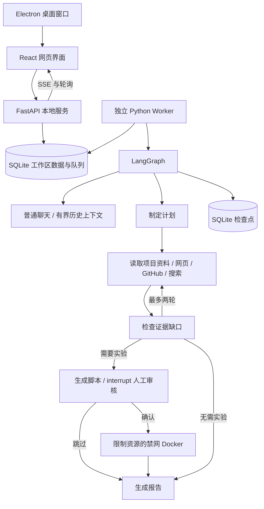

# Sakuya 实现结构

## 数据与状态

- `project`：项目约束、仓库地址。
- `document`：项目 Markdown、保存的报告，包含演示标记。
- `conversation`：对话标题、时间、持久化排序 `position` 与软删除标记 `deleted_at`。
- `run`：问题、任务类型、模式、状态、计划、资料、报告、token 用量。聊天轮次使用 `kind=chat`，关联 `conversation_id` 和入队时的历史上下文快照。
- `events`：步骤摘要、错误和状态事件。不会展示隐藏思维链。
- 图检查点位于 `checkpoints.sqlite`，业务对象位于 `workspace.sqlite`。

任务：`queued → running → completed/failed/waiting/cancelled`。
等待审核：`waiting → queued → running`，通过持久化的 resume 决策继续图。
失败重试只重新排队，由 LangGraph 读取最近检查点。取消后不会自动恢复。

任务领取和状态更新使用 SQLite 事务；事件与业务对象不是同一个事务，进程在事件写入与检查点提交之间退出时，恢复后可能重复记录事件或外部读取。真实模型调用也可能重复计费，因此不声称 exactly-once 执行。

本地版本默认一个 Worker。心跳每五秒更新，超过 45 秒没有心跳的运行任务重新排队。生产环境需要进一步采用带 fencing token 的租约、明确的并发限额、幂等工具和用户权限。

## 聊天与界面

`POST /api/chat` 在同一事务中保存对话、聊天任务与历史快照；同一对话只能有一个待执行或执行中的轮次。已有后续消息时不允许重试旧轮次，避免使用过期上下文。聊天与研究共享持久化队列及 LangGraph 检查点，聊天走独立 `chat` 节点，普通聊天不会进入研究工具分支。

对话重命名、删除、恢复与排序使用 SQLite 写事务。排序不会改动消息更新时间；旧对话在初始化时补充位置，新对话插到最前。排序请求期间其他窗口新建的对话会保留在前面；包含重复或已删除 ID 的请求被拒绝。删除保留记录供撤销，同时原子取消相关待执行或执行中的聊天任务，避免正在运行的 Worker 写回可见回复。

工作区 API 将聊天轮次放入 `chats`，其他 Agent 任务放入 `runs`。前端用 `#chat/:id` 恢复对话，运行期间每 800 毫秒轮询。取消后即使供应商完成请求，也不会发布该回复；取消不保证中断供应商端生成或计费。

`Presence` 在关闭时保留 DOM 180 毫秒完成退出动画，并用 `inert` 禁止交互。`Fold` 使用网格高度过渡实现资料与高级选项的展开收回。弹窗有焦点约束，菜单支持 Escape 和方向键，动画遵循 `prefers-reduced-motion`。

## 资料与执行边界

文档被分割成 1250 字符片段，步长 1050；中文双字词和英文标识符评分选取相关片段。网页来源保存最多 22000 字符；搜索摘要明确标记为摘要。研究默认最多两轮，每轮最多两个搜索词。模型输入中的证据总量受到限制。

GitHub 读取固定到提交 SHA，当前只调查有限文件，不能据此保证完整仓库覆盖。实验只能读取资料 JSON 和生成的标准库脚本，不安装依赖或修改宿主仓库。

## 交付范围

可工作的本地应用：网页、桌面客户端、持久化 API、独立执行进程、真实供应商适配器和明确的演示路径。未包含公网认证、多租户或外部生产部署。

## 独立启动与服务生命周期

`electron/main.cjs` 负责桌面/网页入口和单实例。`electron/service.cjs` 先检查回环端口的服务标识和 Worker 状态；匹配的已运行服务直接复用，其他服务占用端口时给出错误，不强制结束它。正常启动会运行 `resources/backend/sakuya-service.exe`，传入数据目录和 `resources/web` 静态资源目录，等待就绪后加载界面。

`backend/service.py` 将 FastAPI 和单一 Worker 放入同一进程，监听 `127.0.0.1`。Python 运行时及依赖由 PyInstaller 随程序分发，不依赖用户 PATH。主进程持有后端标准输入管道：正常退出或崩溃时管道关闭，后端退出，不留下占用端口的孤立进程。已有 LangGraph 检查点和过期心跳机制负责下次启动的任务恢复。

桌面模式关闭窗口会退出；网页模式保留托盘进程，关闭桌面窗口不影响浏览器。托盘可切换两种界面或退出服务。退出仅停止当前实例拥有的后端。两种入口都不调用 Vite，也不要求用户预先运行 Node 命令。
